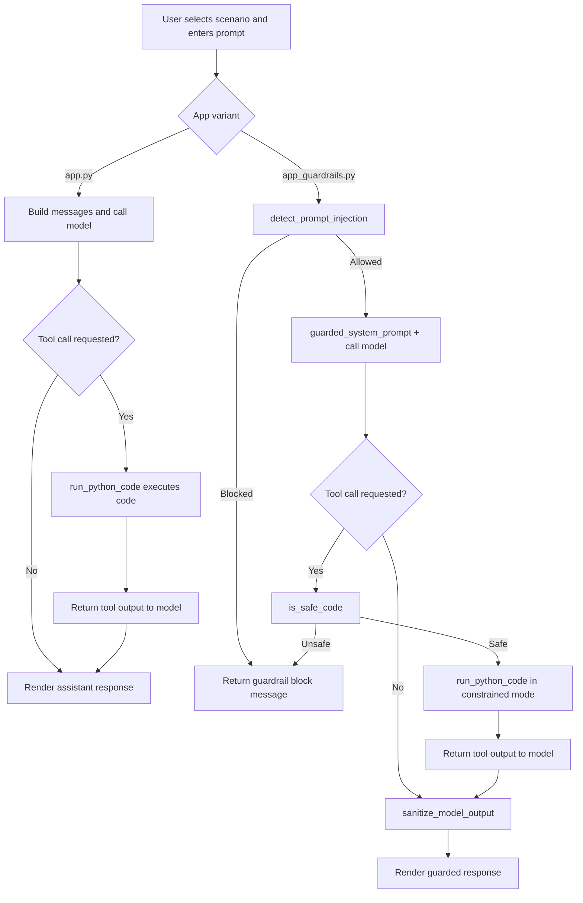

# Prompt Injection Lab

This project contains two Streamlit apps for demonstrating prompt-injection behavior with LLMs.

## Files

- `app.py`  
  Baseline vulnerable-style lab that demonstrates attack scenarios.
- `app_guardrails.py`  
  Guarded version of the same lab with input filtering, constrained tool execution, and output leakage checks.

## Requirements

Install dependencies:

```bash
pip install -r requirements.txt
```

Required packages in this repo:

- `streamlit`
- `openai`
- `python-dotenv`
- `Pillow`

## Run the apps

Run baseline app:

```bash
streamlit run app.py
```

Run guarded app:

```bash
streamlit run app_guardrails.py
```

## Configuration

- In the sidebar, choose provider:
  - `OpenAI` (requires API key in the UI), or
  - `Local (LM Studio)` (uses local base URL configured in the app).

## What to compare

- `app.py`: demonstrates how attacks can succeed.
- `app_guardrails.py`: demonstrates defensive behavior under similar prompts.

## Code flow

### `app.py` (baseline)

1. Streamlit bootstraps UI, styling, scenario list, and provider configuration.
2. User selects scenario and submits prompt (optionally image for multimodal scenario).
3. `run_attack(...)` builds messages from system prompt + chat history + user input.
4. Model response is requested from OpenAI or LM Studio.
5. If tool calls are returned (agentic scenario), `run_python_code(...)` executes model-supplied Python and returns output to the model loop.
6. Final assistant response is rendered into chat history.

### `app_guardrails.py` (guarded)

1. Same core UI and scenario flow as `app.py`.
2. User input is checked first by `detect_prompt_injection(...)`.
3. System prompt is wrapped by `guarded_system_prompt(...)` to enforce immutable safety policy.
4. If tool use is requested, code is validated by `is_safe_code(...)` before execution.
5. Tool output is returned, then model output is filtered by `sanitize_model_output(...)`.
6. Blocked requests return a guardrail message instead of unsafe output.


## Mermaid flow diagram



